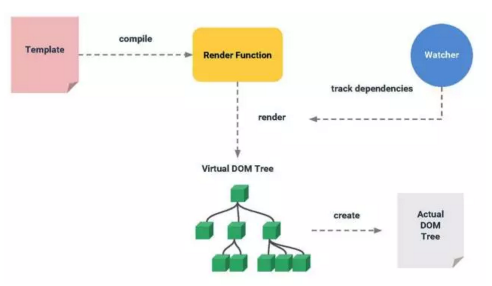
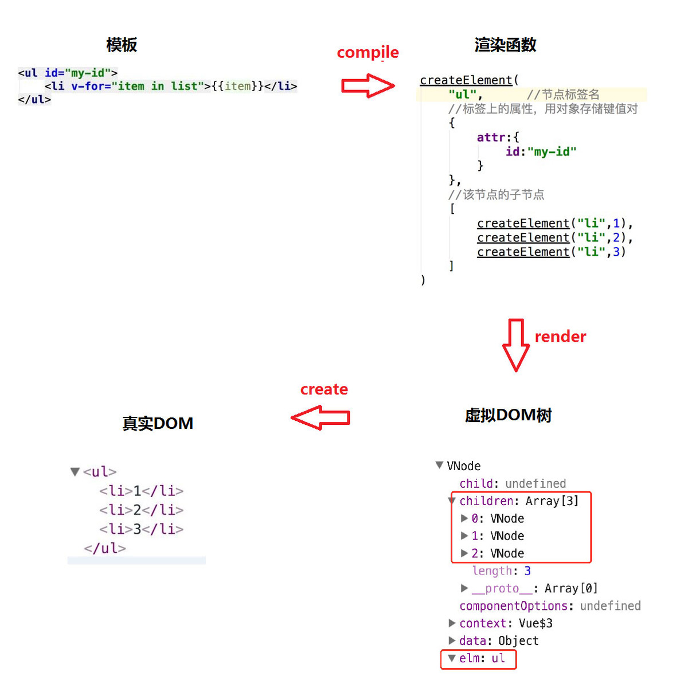

```js
<div id="app-7">
  <ol>
    <!--
      现在我们为每个 todo-item 提供 todo 对象
      todo 对象是变量，即其内容可以是动态的。
      我们也需要为每个组件提供一个“key”，稍后再
      作详细解释。
    -->
    <todo-item
      v-for="item in groceryList"
      v-bind:todo="item"
      v-bind:key="item.id"
    ></todo-item>
  </ol>
</div>

Vue.component('todo-item', {   //组件全局注册，还有个局部注册。一个组件其实就是vue实例嘛
  props: ['todo'],  //属性 prop 父组件是vue ，子组件就是本身。父组件给我传递数据用的
  template: '<li>{{ todo.text }}</li>'  //模板
})

var app7 = new Vue({
  el: '#app-7',
  data: {
    groceryList: [
      { id: 0, text: '蔬菜' },
      { id: 1, text: '奶酪' },
      { id: 2, text: '随便其它什么人吃的东西' }
    ]
  }
})

```

<chart></chart>  ???

 ```  render: (h, params) => {
            return h('div', params.row.Value.toFixed(2))
          }

```
视图view和状态state->state就是在data定义的数据嘛的统一管理
VueX背后的设计思想


热重载hot-reloading
cli为你搞定大多数工具的配置问题
渐进式开发就是一层一层
1->2->3->4->5
1. 声明式渲染就是把数据渲染偶到视图
2. 组件系统 模块化
3. 客户端路由(移动端/单页应用)
4. 大规模状态管理 就是数据共享
5. 构建工具就是模块打包

响应式的数据绑定就是当数据发送改变的时候自动更新视图
利用了Objection.definedProperty的setter和gettter代理数据
来实现监控的.当它的数据发生改变,就会去更新试图啦啦啦

虚拟DOM就是在内存中生成一个与真实dom的数据结构,
在内存中生成的dom就是虚拟DOm
那么虚拟 DOM 有什么用么，这个就要先从真实 DOM 开始说起啦。我们都只到js的运行速度是非常快的，但是执行中又不可避免的会操作很多页面上的 DOM，这样就造成了运行速度的减慢。经常在更新数据以后，要重新渲染，包括没有数据改变的地方，造成了很大程度上的资源浪费。
这个时候，虚拟 DOM 出现了，当数据发生改变的时候，它能够通过对比数据，准确的找到数据发生改变的地方，并且针对这个地方进行渲染，以很小的代价完成了 DOM 操作。




MVVM
M 层就是我们拿到的数据和业务逻辑，V 层就是用于数据展示的，VM 呢就是处理 M 和 V 之间关系用的，所有的脏活累活都是它来干的。视图影响数据，数据又影响着视图，这就是所谓的双向数据绑定。
`var vm = new Vue()`
vm里面就是干活的
每一个Vue的实例都会代理其data对象里面所有的属性,这些被代理的属性是响应式的,新添加的属性不具备响应功能,改变后不会更新视图.另外,Vue会暴露自己的属性和方法,以$开头的
`console.log(vm)`打印出来的属性就是以$开头的

声明式渲染:就是知道你想做啥就行,不需要知道具体的做法
命令式渲染:就是不管你做啥,你就要去具体怎么做
你只要吧数据挂载在$el上就好了,具体它是怎么找到el的,怎么把data绑定到el的不用管的

./当前的目录
../ 当前目录的上一层目录

@以根目录的方法定义相对路径  在webpack.base.conf.js中配置

change click on-change on-current-change

**当定义一个组件的时候嘛。它里面的data并不是像这样直接对象**
```javaScript
data:{
  count:0
}

```
取而代之的是，一个组件的data选项必须是一个函数。这样每个使用这个组件的实例嘛，才不会互相影响，他们返回的都是独立的拷贝
```javaScript
data:function(){
  return{
    count:0
  }
}
```

slot是父组件与子组件的通讯方式，可以将父组件的内容显示在子组件当中  。子组件中定义<slot></slot>
prop是父组件的属性中来传递数据的